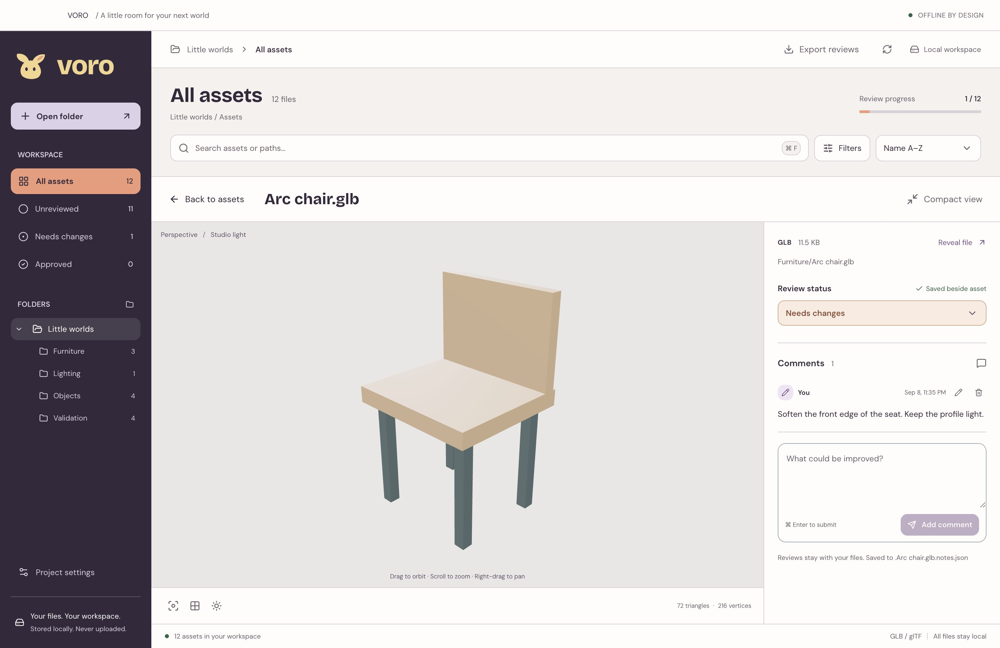
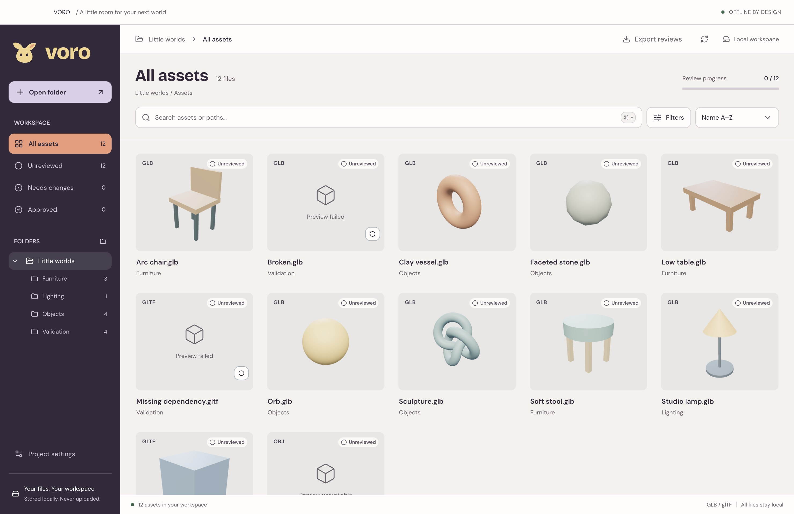

# VORO

**Small details. Bigger worlds.**

A local workspace for game artists and developers to browse 3D assets, inspect the details, and leave feedback beside the files. Open a project folder and start reviewing. No account, upload, or server required.

[](LICENSE)



## A little room for better assets

- **Find your next detail.** Browse folders, search filenames, and filter by review status, format, comments, or available previews.
- **See the whole thing.** Click an asset for a large interactive preview. Orbit, pan, zoom, inspect wireframes, and play supported animations.
- **Keep feedback close.** Mark assets as Unreviewed, Needs changes, or Approved. Save comments into small JSON sidecars beside each source file.
- **Take your reviews with you.** Export saved project reviews as structured JSON, readable by people, scripts, and AI tools. Published [JSON Schemas](docs/REVIEW_FORMAT.md) describe the format.
- **Stay in your project.** Files, cached thumbnails, and device-only drafts stay local. No cloud sync or issue-tracker integration is required or implemented.



Screenshots show the real app with synthetic sample assets and illustrative reviews. See [screenshot provenance](docs/images/README.md).

## Try it

VORO’s first [early-access release](https://github.com/usevoro/voro/releases/tag/v0.1.0-alpha.1) includes macOS Apple silicon/Intel, Windows x64, and Linux x64. Mac builds are Developer ID signed and Apple-notarized; Windows and Linux are unsigned experimental cross-builds. Apple silicon passed the packaged-app workflow tests; native Intel/Windows/Linux testing is still pending. See [downloads, installation, and limitations](docs/DOWNLOADS.md).

To run from source, use **Node.js 22.13+ in the 22.x line** (the version selected by `.nvmrc`):

```sh
git clone https://github.com/usevoro/voro.git
cd voro
nvm use
npm ci
npm start
```

Choose **Open folder**, or generate a small practice project first:

```sh
npm run fixtures -- /tmp/voro-sample
```

Open `/tmp/voro-sample` in VORO. It contains synthetic furniture, objects, animation, and deliberate error cases for testing recovery.

| Format                                    | Browse and review | Interactive preview                                              |
| ----------------------------------------- | ----------------- | ---------------------------------------------------------------- |
| GLB / glTF                                | Yes               | Yes, including locally bundled Draco, Meshopt, and KTX2 decoders |
| FBX, OBJ, BLEND, USD / USDA / USDC / USDZ | Yes               | Not yet                                                          |

Support has been checked against specific fixtures, not every exporter or glTF extension. See the [validation matrix and release limits](docs/IMPLEMENTATION.md).

## Reviews belong with the work

A model named `chair.glb` gets a review file named `.chair.glb.notes.json`. Saved reviews travel with the project; VORO’s SQLite catalog and thumbnail cache can be rebuilt. Unsaved drafts stay on the current device and are excluded from exports.

Saves are explicit, and VORO detects stale revisions and preserves malformed notes. This is optimistic conflict protection; sync clients can still race a save. See [review files and export](docs/REVIEW_FORMAT.md) for the schema, identity rules, and limitations.

## Help VORO grow

Bug reports, focused fixes, documentation, and reproducible format samples are welcome. Read [CONTRIBUTING.md](CONTRIBUTING.md) for setup, checks, and the pull-request workflow. Use synthetic or shareable assets and remove personal paths from screenshots.

- [Report a bug or propose an improvement](https://github.com/usevoro/voro/issues)
- [Report a vulnerability privately](SECURITY.md)
- [Development, packaging, keyboard controls, and architecture](docs/DEVELOPMENT.md)
- [Design guide](DESIGN.md) and [brand assets](brand/README.md)
- [Product website source](https://github.com/usevoro/website)

Website changes belong in `usevoro/website`; `site/` here is an archived pre-extraction snapshot. Community participation follows our [Code of Conduct](CODE_OF_CONDUCT.md).

## License

VORO is available under the [MIT license](LICENSE). Fonts, decoder dependencies, and attributed fixtures retain their own licenses; see [third-party notices](THIRD_PARTY_NOTICES.md).
